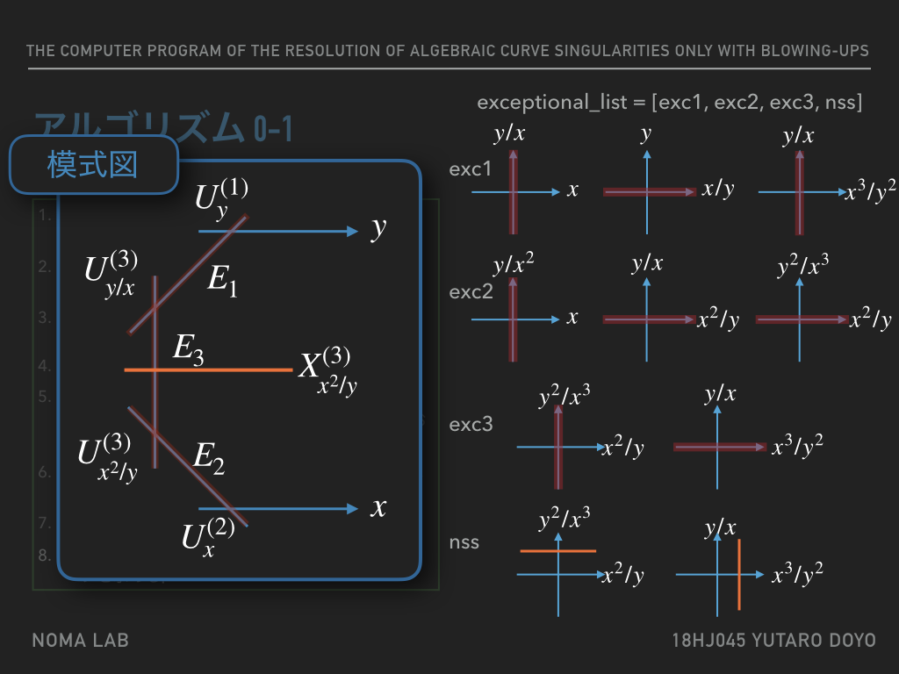

# 代数曲線のブローアップのみを用いた特異点解消コンピュータプログラム
横浜国立大学大学院環境情報学府情報環境専攻数理科学プログラム  
野間研究室18HJ045 道用悠太朗

## スライドのPDF
[こちら](https://github.com/dafuyafu/curve_resolution/blob/master/master_thesis_slide.pdf)．

## 概要
本記事は発表における研究内容を補足するものであり，修士論文の内容において，時間の都合上発表できないものの中で特筆すべき事項をまとめている．そのため，本記事は発表中および発表後に読まれることを想定して記した．  

## 新規性と独自性

　特異点解消は代数幾何学における主要な課題の一つであるだけでなく，情報科学や統計学といった様々な分野との融合した幅広い応用が期待されている現代的なツールでもある．そのため，数学を専攻していない人に対しても，特異点を解消する手続きは理解しやすいものでなければならないことは明らかである．しかし，特異点解消の最も初等的な手法の一つである**ブローアップ**は計算が煩雑であるという欠点を持つ．一方で，対応するトーリック多様体における扇の分割で特異点解消を求める方法や，多項式の指数だけを取り出して算術的に求める方法は，計算は簡単でも具体的に曲線や曲面といった幾何対象がどのように変化していくのかを追って理解することが困難である．困難である，というのは，算術的な計算が幾何対象の変化にどのように対応するかを知識として持つのは専門家に限られるという意味である．  
　本研究では，
 
1. 煩雑な計算をコンピュータで行わせることによる高速化
1. 多項式の変換のみを用いることにより，初学者でも理解しやすくする

という2つの事が目標となっている．2つめの目標はPythonおよびそのライブラリを用いることにより比較的簡単に達成することが出来る．しかし，1つめの目標は，式を一般化した際にアルゴリズムが対応できず，解消の計算や判定が正しく行われないという不具合が発生する．本修士論文では特別な場合に限定してプログラムを制作したが，より一般の場合への対応が今後の課題となっている．

## プログラムについて

　本論文において制作したプログラムは，条件に合致した式を入力するとブローアップの計算過程とその特異点解消の双対グラフを出力するものである．しかし，発表でも言及したとおり，その中間生成物たる**ブローアップの模式図**をコンピュータ上で再現することがこのプログラムの最も重要な部分である．
 

ここで，実行例の曲線  の特異点解消の説明スライドの中で，模式図と関連しているスライドについて説明を加える．

  を特異点解消すると，左のような模式図を得る．これをコンピュータ上で再現することが課題となっていた．ここで右半分について説明する．これは，計算途中で生成したExceptionalCurveインスタンスexc1, exc2, exc3およびNonsingularStrictTransformインスタンスnssが持つ情報を図示しているに過ぎない．例えば，exc1については，カルティエ因子として

という値を保持している，つまり， x と y/x というラベルの軸を持つアフィン開集合上では x = 0 と表されており，同様にAA(x/y,y)上では y = 0 と表されている，といった情報を持っていることを表している.  
　ここで，貼り合わせの情報は AA(x＊＊3/y＊＊2,y/x) および AA(x＊＊2/y, y＊＊2/x＊＊3) のみが持っていることに注意する．実際，ブローアップはこのアフィン開集合で最後に行われており，再帰呼び出しから戻ってきたあとのアフィン開集合は貼り合わせの情報を消している．
 

こうすることで，模式図に出てこないアフィン開集合上での情報を取り除くことが出来る．貼り合わせの情報は赤色の矢印のように保持しており，ちょうど模式図の開集合と対応していることが分かる．このようにして，プログラムは模式図を再現している．

さらに，出力結果はこの図のように出力される．右図はそのまま双対グラフであるが，左は計算の過程が出力されている．ブローアップの狭義変換の式が出力され，それが特異点を持つか，さらにそれが例外曲線と正規交差を持つか，といったことが出力されている．この例では特に意味のない座標変換が行われているが，原点以外をブローアップの中心としなければならない場合はこのように適宜座標変換を行う．最後には計算で発生した例外曲線と最終的な狭義変換をカルティエ因子として出力している．